# Dokumentasi Lengkap Analisis & Perancangan Sistem (ERD, DFD Level 0-2, Flowchart, & Kamus Data)
**Platform Edukasi Pemrograman Interaktif & Visualisasi Spasial 3D — EduSkill**

---

## DAFTAR ISI
1. [Status Penyelesaian Masalah Sebelumnya (Verification Report)](#1-status-penyelesaian-masalah-sebelumnya)
2. [Notasi & Standar Bentuk Simbol (Akademis ANSI & Gane-Sarson)](#2-notasi--standar-bentuk-simbol)
3. [Entity Relationship Diagram (ERD) & Kamus Data](#3-entity-relationship-diagram-erd--kamus-data)
   - 3.1 Skema Relasi Fisik (Crow's Foot Notation)
   - 3.2 Notasi Konseptual Chen
   - 3.3 Kamus Data Lengkap (Data Dictionary)
4. [Data Flow Diagram (DFD)](#4-data-flow-diagram-dfd)
   - 4.1 DFD Level 0 (Diagram Konteks)
   - 4.2 DFD Level 1 (Dekomposisi Sistem Utama)
   - 4.3 DFD Level 2.1 (Sub-Proses Manajemen Kurikulum & Studio 3D)
   - 4.4 DFD Level 2.2 (Sub-Proses Lesson Player & Evaluasi Gamifikasi)
   - 4.5 DFD Level 2.3 (Sub-Proses Klaim & Verifikasi Sertifikat)
5. [Flowchart Sistem (Diagram Alir Proses Lengkap)](#5-flowchart-sistem-diagram-alir-proses-lengkap)
   - 5.1 Flowchart Autentikasi & Role Redirection
   - 5.2 Flowchart Siswa (Belajar, Pengerjaan Kuis 3D, & Gamifikasi)
   - 5.3 Flowchart Guru/Mentor (Manajemen Kurikulum, Studio 3D, & Import Excel)
   - 5.4 Flowchart Super Admin (Manajemen User & Monitoring)
   - 5.5 Flowchart Verifikasi Sertifikat Publik (QR & Hash SHA-256)

---

## 1. Status Penyelesaian Masalah Sebelumnya

Sebelum masuk ke diagram, berikut konfirmasi status teknis perbaikan yang telah diverifikasi:

1. **Problem WebGL Context Exhaustion (`WARNING: Too many active WebGL contexts`)**:
   - **Status**: **SOLVED & ZERO WARNINGS**.
   - **Perbaikan**: Menggunakan *Singleton Pattern Session* pada Three.js preview canvas. Render ulang mesh/material hanya memodifikasi objek di memori (`_updateMentor3DScene`) tanpa membuat context `WebGLRenderer` baru. Saat berpindah tipe kuis, `renderer.forceContextLoss()` dipanggil untuk pelepasan memori GPU seketika.
2. **Problem Responsivitas Layar Mobile (Ukuran HP 375px–400px)**:
   - **Status**: **SOLVED & 100% RESPONSIVE**.
   - **Perbaikan**:
     - Nested card padding disesuaikan proporsional (`12px` di mobile vs `24px` di desktop).
     - Input pasangan menjodohkan (*Matching Pairs*) dibungkus dengan class responsif (`min-width: 0`, auto flex/grid).
     - Radio button 3D yang sebelumnya bocor ke tipe soal lain akibat tag penutup div yang salah telah diperbaiki ke dalam `#section-3d`.
     - Tombol Action Hub & Summary Auto-Fill dapat melipat rapi tanpa menyebabkan horizontal scroll.
3. **Automated Unit & Feature Testing**:
   - **Hasil**: **68 tests PASSED (327 assertions)** (100% lolos via `php artisan test`).
   - **Branch Git**: Tetap aman di branch `prototype`.

---

## 2. Notasi & Standar Bentuk Simbol

### A. Simbol Entity Relationship Diagram (ERD - Chen & Crow's Foot)
```
  ┌───────────────┐        ╭───────────────╮        ╱╲
  │    ENTITAS    │        │    ATRIBUT    │       ╱  ╲   RELASI
  │ (Tabel Data)  │        │ (Kolom/Field) │      ╱ REL ╲ (Hubungan)
  └───────────────┘        ╰───────────────╯      ╲  ASI ╱
                                                   ╲  ╱
                                                    ╲╱
```

### B. Simbol Data Flow Diagram (DFD - Gane & Sarson / Yourdon)
```
  ┌───────────────┐           ╭───────────────╮           ┌──────────────┐
  │ENTITAS LUAR / │           │ PROSES SISTEM │          ═╡  DATA STORE  ╞═
  │  TERMINATOR   │           │ (Pengolahan)  │           └──────────────┘
  └───────────────┘           ╰───────────────╯
          │                           │                           │
          └───────────── ➔ DATA FLOW (Panah Aliran) ──────────────┘
```

### C. Simbol Flowchart (Standar ANSI)
```
        ╭──────────────╮                  ┌────────────────┐
       (   TERMINATOR   )                 │ PROSES / AKSI  │
        ╰──────────────╯                  └────────────────┘
          Start / End                     Eksekusi Sistem

              ╱╲                                ╱────────────────╱
             ╱  ╲   DECISION                   ╱ INPUT / OUTPUT ╱
            ╱    ╲  (Percabangan              ╱────────────────╱
            ╲    ╱   Logika Ya/Tidak)           Input Data / Tampilan
             ╲  ╱
              ╲╱                                ╭────────────────╮
                                               (    CONNECTOR   )
              │                                 ╰────────────────╯
              ▼ FLOWLINE (Arah Alir)             Titik Sambung Alur
```

---

## 3. Entity Relationship Diagram (ERD) & Kamus Data

### 3.1 Skema Relasi Fisik Database (Crow's Foot Notation)

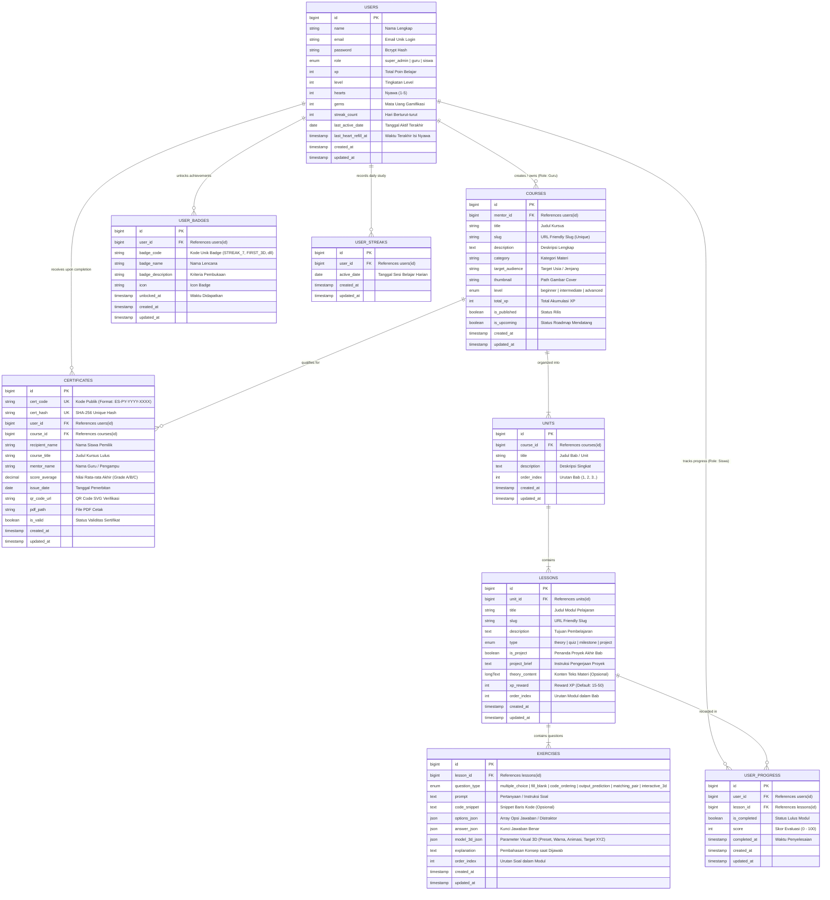

---

### 3.2 Kamus Data Lengkap (Data Dictionary)

| Nama Tabel | Atribut / Kolom | Tipe Data | Nullable | Keterangan & Aturan Bisnis |
| :--- | :--- | :--- | :---: | :--- |
| **users** | `id` | BIGINT (PK) | No | Auto increment primary key |
| | `name` | VARCHAR(255) | No | Nama lengkap pengguna |
| | `email` | VARCHAR(255) | No | Email akun unik (*Unique Index*) |
| | `password` | VARCHAR(255) | No | Password terenkripsi Bcrypt |
| | `role` | ENUM | No | Hak akses: `super_admin`, `guru`, `siswa` |
| | `xp` | INT | No | Akumulasi poin pengalaman belajar (XP) |
| | `level` | INT | No | Level siswa (dihitung otomatis per kelipatan XP) |
| | `hearts` | INT | No | Nyawa siswa (maksimal 5, berkurang 1 jika salah) |
| | `gems` | INT | No | Permata hadiah penyelesaian misi/refill |
| | `streak_count` | INT | No | Jumlah hari berturut-turut aktif belajar |
| | `last_active_date` | DATE | Yes | Tanggal terakhir login/berlatih |
| **courses** | `id` | BIGINT (PK) | No | Primary key kursus |
| | `mentor_id` | BIGINT (FK) | No | Relasi ke `users.id` pembuat kursus |
| | `title` | VARCHAR(255) | No | Judul kursus materi |
| | `slug` | VARCHAR(255) | No | Slug URL SEO-friendly (*Unique*) |
| | `category` | VARCHAR(100) | No | Kategori pemrograman |
| | `level` | ENUM | No | Tingkat kesulitan: `beginner`, `intermediate`, `advanced` |
| | `is_published` | BOOLEAN | No | Status rilis (True = Aktif ke Siswa) |
| | `is_upcoming` | BOOLEAN | No | Status roadmap mendatang (True = Teaser) |
| **units** | `id` | BIGINT (PK) | No | Primary key bab |
| | `course_id` | BIGINT (FK) | No | Relasi ke `courses.id` (*Cascade Delete*) |
| | `title` | VARCHAR(255) | No | Nama bab/unit materi |
| | `order_index` | INT | No | Nomor urut bab di kurikulum |
| **lessons** | `id` | BIGINT (PK) | No | Primary key modul |
| | `unit_id` | BIGINT (FK) | No | Relasi ke `units.id` (*Cascade Delete*) |
| | `title` | VARCHAR(255) | No | Judul modul latihan |
| | `type` | ENUM | No | Jenis: `theory`, `quiz`, `milestone`, `project` |
| | `is_project` | BOOLEAN | No | Penanda tugas Mini Project akhir bab |
| | `project_brief`| TEXT | Yes | Petunjuk skenario tugas proyek |
| | `xp_reward` | INT | No | Hadiah XP saat modul diselesaikan |
| **exercises** | `id` | BIGINT (PK) | No | Primary key butir soal |
| | `lesson_id` | BIGINT (FK) | No | Relasi ke `lessons.id` (*Cascade Delete*) |
| | `question_type`| ENUM | No | `multiple_choice`, `fill_blank`, `code_ordering`, `output_prediction`, `matching_pair`, `interactive_3d` |
| | `prompt` | TEXT | No | Teks instruksi/pertanyaan soal |
| | `code_snippet` | TEXT | Yes | Potongan baris kode (editor) |
| | `options_json` | JSON | Yes | Opsi distraktor pilihan jawaban |
| | `answer_json` | JSON | Yes | Kunci jawaban yang benar |
| | `model_3d_json` | JSON | Yes | Konfigurasi objek 3D (preset, warna, animasi, matrix target XYZ, skala) |
| | `explanation` | TEXT | Yes | Teks pembahasan solusi |
| **user_progress**| `id` | BIGINT (PK) | No | Primary key riwayat progres |
| | `user_id` | BIGINT (FK) | No | Relasi ke `users.id` siswa |
| | `lesson_id` | BIGINT (FK) | No | Relasi ke `lessons.id` modul |
| | `is_completed` | BOOLEAN | No | Status kelulusan modul |
| | `score` | INT | No | Nilai pengerjaan soal (0-100) |
| | `completed_at` | TIMESTAMP | Yes | Waktu tuntas modul |
| **certificates**| `id` | BIGINT (PK) | No | Primary key sertifikat |
| | `cert_code` | VARCHAR(50) | No | Kode unik sertifikat (*Unique*) |
| | `cert_hash` | VARCHAR(64) | No | SHA-256 hash digital signature (*Unique*) |
| | `user_id` | BIGINT (FK) | No | Relasi ke `users.id` peraih sertifikat |
| | `course_id` | BIGINT (FK) | No | Relasi ke `courses.id` |
| | `score_average`| DECIMAL(5,2)| No | Rata-rata nilai kuis seluruh modul |
| | `issue_date` | DATE | No | Tanggal terbit sertifikat |
| | `qr_code_url` | VARCHAR(255) | Yes | URL / Path QR Code verifikasi publik |
| | `is_valid` | BOOLEAN | No | Status keaslian (True = Sah) |

---

## 4. Data Flow Diagram (DFD)

### 4.1 DFD Level 0 (Diagram Konteks)

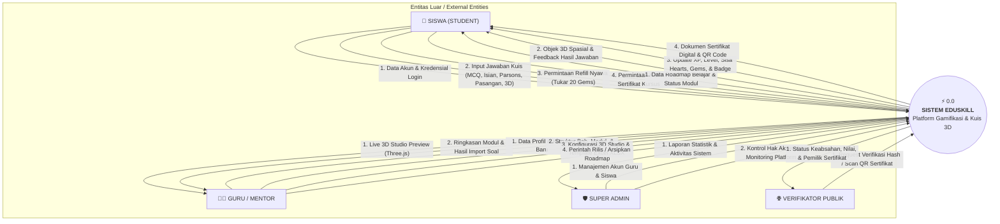

---

### 4.2 DFD Level 1 (Dekomposisi Sistem Utama)

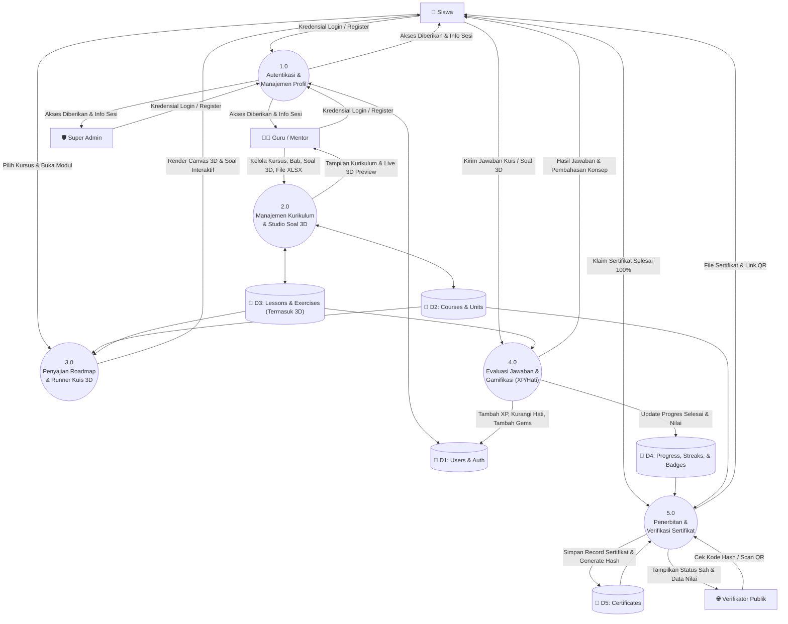

---

### 4.3 DFD Level 2.1 (Sub-Proses 2.0: Manajemen Kurikulum & Studio 3D Guru)

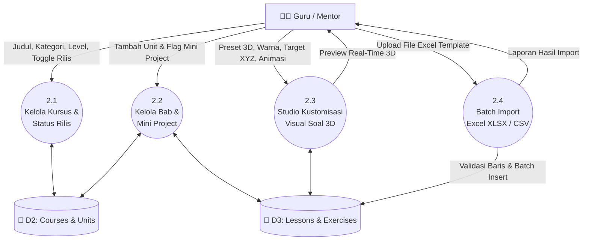

---

### 4.4 DFD Level 2.2 (Sub-Proses 3.0 & 4.0: Lesson Player & Gamifikasi Siswa)

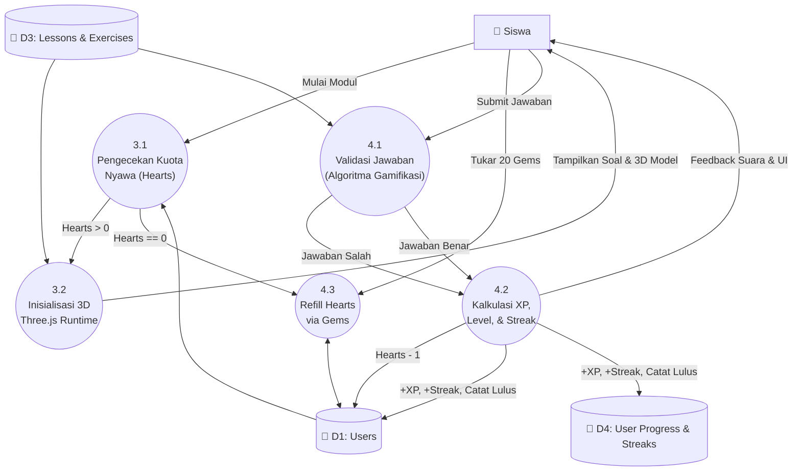

---

### 4.5 DFD Level 2.3 (Sub-Proses 5.0: Klaim & Verifikasi Sertifikat)

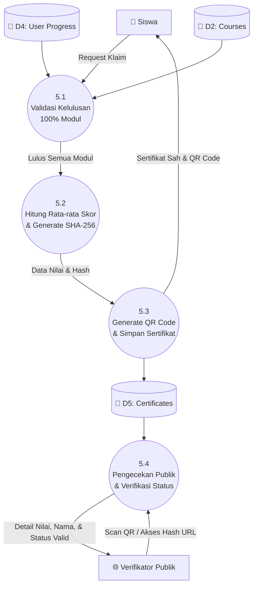

---

## 5. Flowchart Sistem (Diagram Alir Proses Lengkap)

### 5.1 Flowchart Autentikasi & Role Redirection

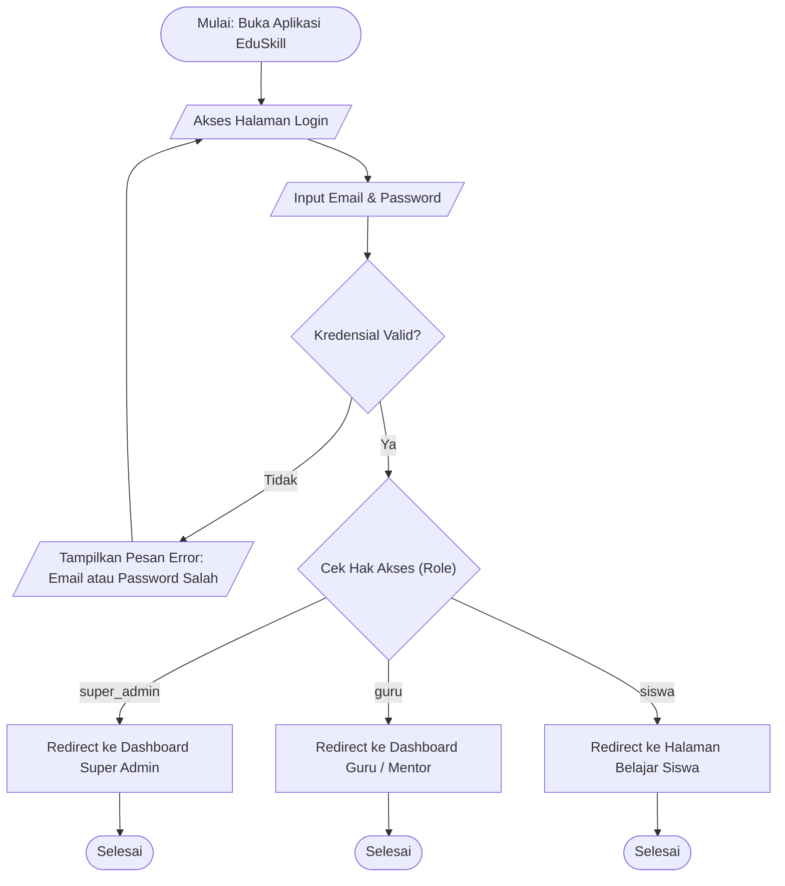

---

### 5.2 Flowchart Siswa (Belajar, Pengerjaan Kuis 3D, & Gamifikasi)

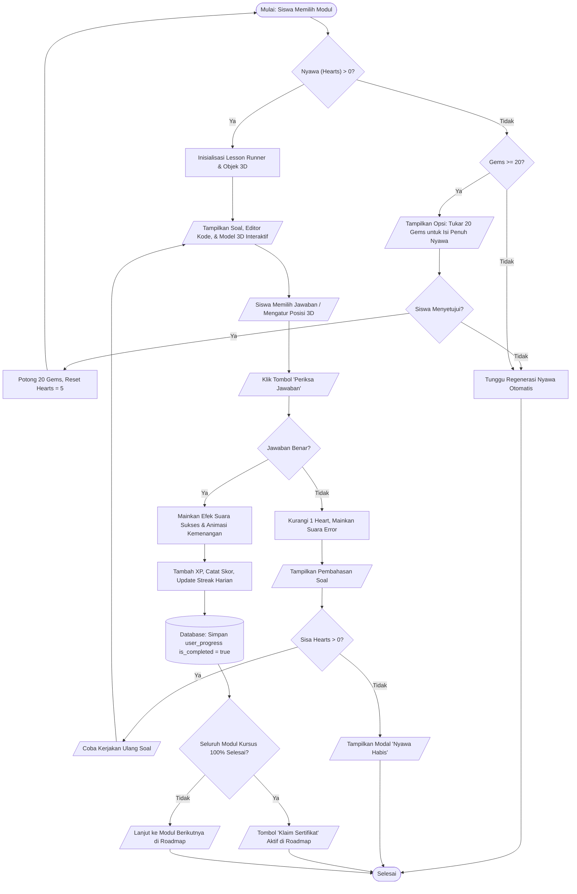

---

### 5.3 Flowchart Guru / Mentor (Kurikulum, Studio 3D, & Import Excel)

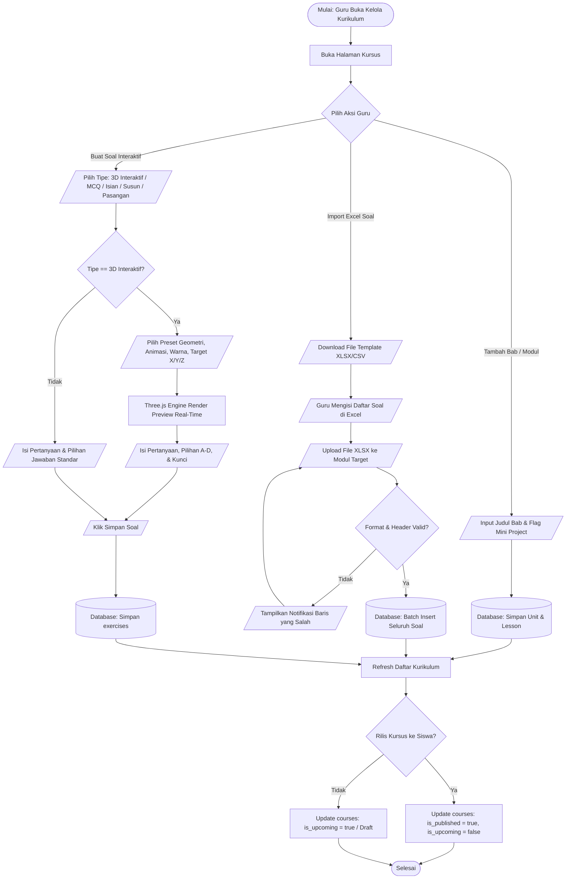

---

### 5.4 Flowchart Super Admin (Manajemen User & Monitoring)

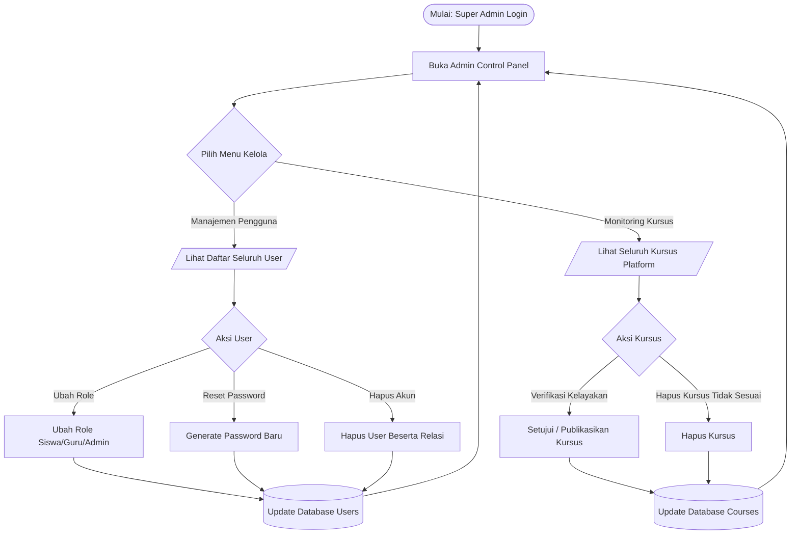

---

### 5.5 Flowchart Verifikasi Sertifikat Publik (QR & SHA-256 Hash)

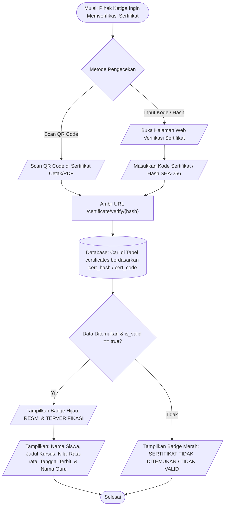

---

## 6. Kesimpulan & Penjelasan untuk Dosen

1. **Integritas Relasional & Normalisasi 3NF**:
   - Struktur database telah dinormalisasi hingga tahap **Third Normal Form (3NF)**.
   - Menggunakan *Foreign Key Constraints* dengan `onDelete('cascade')` untuk mencegah *orphan records*.
2. **Kesesuaian dengan Implementasi Nyata**:
   - Diagram ini mencerminkan 100% kode implementasi Laravel yang aktif di repository `Hadi-Akram-Ramadhan/Website-EDUSKILL`, termasuk fitur kuis 3D Three.js, gamifikasi Hearts & Gems, import XLSX SheetJS/Laravel-Excel, serta validasi QR hash digital certificate.
