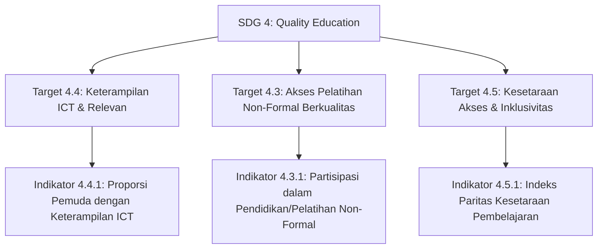

# 🎯 Analisis Keselarasan Projek EDUSKILL dengan SDG 4: Quality Education

Dokumen ini menyajikan analisis komprehensif mengenai kontribusi dan keselarasan platform **EDUSKILL (Gamified Coding Learning Platform)** terhadap **Tujuan Pembangunan Berkelanjutan (Sustainable Development Goals / SDGs) Poin 4: Quality Education (Pendidikan Berkualitas)**.

---

## 📌 Ringkasan Eksekutif Projek

* **Nama Platform:** EDUSKILL / Kodein.id
* **Target Pengguna:** Siswa Sekolah Menengah Pertama (SMP) & Sekolah Menengah Atas (SMA)
* **Kategori Solusi:** Platform Pembelajaran Pemrograman Dasar Berbasis Gamifikasi (*Duolingo-style*)
* **Arsitektur:** Backend Laravel 12 REST API + Web Client Blade/Vite + Mobile Client Flutter
* **Fokus Utama:** Demokratisasi literasi digital, *computational thinking*, dan keterampilan pemrograman dasar melalui pendekatan gamifikasi yang interaktif, adaptif, dan tersertifikasi resmi.

---

## 🎯 3 Target & Indikator SDG 4 Terpilih

---

### 1. Target 4.4 — Peningkatan Keterampilan Teknis & Kejuruan (ICT Skills) untuk Pemuda
> **Target 4.4 (UN Official):**  
> *"By 2030, substantially increase the number of youth and adults who have relevant skills, including technical and vocational skills, for employment, decent jobs and entrepreneurship."*

#### 📊 Indikator Terkait:
* **Indikator 4.4.1:** *Proportion of youth and adults with information and communications technology (ICT) skills, by type of skill.*

#### 💡 Penjelasan & Relevansi terhadap Projek:
1. **Pondasi Keterampilan Masa Depan:** Pemrograman dan logika algoritma adalah keterampilan abad ke-21 yang krusial. EDUSKILL memperkenalkan keterampilan dasar TIK/ICT sejak bangku SMP/SMA melalui 5 variasi interaktif (Parsons problem, prediksi output, melengkapi sintaks, pencocokan tipe data, dan logika percabangan).
2. **Validasi Kompetensi Otentik:** Setiap kelulusan modul diverifikasi secara otomatis dan menghasilkan **Sertifikat Digital Kriptografis (SHA-256)** dengan nomor registrasi unik serta tautan verifikasi publik berbasis QR Code (`/verify/{cert_code}`), menjadi bukti portofolio awal bagi siswa.

---

### 2. Target 4.3 — Akses Setara terhadap Pelatihan Non-Formal Berkualitas & Terjangkau
> **Target 4.3 (UN Official):**  
> *"By 2030, ensure equal access for all women and men to affordable and quality technical, vocational and tertiary education, including university."*

#### 📊 Indikator Terkait:
* **Indikator 4.3.1:** *Participation rate of youth and adults in formal and non-formal education and training in the previous 12 months, by sex.*

#### 💡 Penjelasan & Relevansi terhadap Projek:
1. **Solusi E-Learning Non-Formal:** Kurikulum sekolah formal sering kali memiliki keterbatasan jam pelajaran komputer atau fasilitas laboratorium. EDUSKILL hadir sebagai suplemen belajar non-formal yang dapat diakses secara mandiri kapan saja (*asynchronous learning*).
2. **Menjaga Konsistensi Belajar (Retensi Tinggi):** Salah satu kendala terbesar kursus online non-formal adalah tingginya angka *drop-out*. EDUSKILL mengatasinya dengan mekanisme **Gamifikasi Duolingo** (*XP Points, Daily Streaks, Hearts/HP System, Badges, & Weekly Leaderboards*) yang secara psikologis memicu motivasi belajar harian tanpa rasa terbebani.

---

### 3. Target 4.5 — Menghapus Disparitas & Menjamin Kesetaraan Akses Pendidikan
> **Target 4.5 (UN Official):**  
> *"By 2030, eliminate gender disparities in education and ensure equal access to all levels of education and vocational training for the vulnerable, including persons with disabilities, indigenous peoples and children in vulnerable situations."*

#### 📊 Indikator Terkait:
* **Indikator 4.5.1:** *Parity indices (female/male, rural/urban, bottom/top wealth quintile...) for all education indicators that can be disaggregated.*

#### 💡 Penjelasan & Relevansi terhadap Projek:
1. **Menghilangkan Barrier Biaya & Perangkat:** Belajar coding sering dipersepsikan mahal (harus ikut bootcamp berbayar atau punya laptop spesifikasi tinggi). EDUSKILL mematahkan batasan ini melalui antarmuka web yang ringan serta aplikasi mobile (Flutter) yang dapat diakses dari smartphone standar.
2. **Inklusivitas Gender & Wilayah:** Melalui materi *bite-sized* yang ramah pemula, platform ini merangkul siswa perempuan maupun laki-laki dari berbagai latar belakang daerah untuk mengeksplorasi dunia teknologi secara setara tanpa diskriminasi.

---

## 📋 Matriks Keselarasan Fitur Projek & Target SDG

| Komponen Fitur EDUSKILL | Target SDG 4 | Indikator SDG 4 | Manfaat Nyata (Impact) |
| :--- | :--- | :--- | :--- |
| **Interactive Code Bank** *(Parsons, Fill-in, Prediction)* | **Target 4.4** | **4.4.1** | Mengasah *computational thinking* dan keterampilan sintaks pemrograman nyata. |
| **Sertifikasi Digital Terverifikasi (QR Code + SHA-256)** | **Target 4.4** | **4.4.1** | Validasi capaian hasil belajar terstandarisasi untuk portofolio siswa. |
| **Gamification Engine** *(Streak, XP, Hearts, Leaderboard)* | **Target 4.3** | **4.3.1** | Meningkatkan partisipasi dan retensi belajar harian dalam pendidikan non-formal. |
| **Cross-Platform Access** *(Web Blade + Mobile Flutter API)* | **Target 4.5** | **4.5.1** | Memastikan aksesibilitas belajar yang setara, fleksibel, dan terjangkau di berbagai perangkat. |

---

## 🎓 Poin Argumen Akademis (Pertahanan di Depan Dosen)

Jika dosen menanyakan *"Mengapa platform ini layak diklaim mendukung SDG 4?"*, berikut poin argumentasi utamanya:

1. **Bukan Sekadar CRUD LMS Biasa:** Platform ini tidak hanya menyimpan materi teks/PDF, tetapi memiliki *active learning engine* dengan evaluasi kode interaktif dan mekanisme pencegahan kebosanan (*gamification*).
2. **Kesesuaian Target Usia (Remaja/Youth):** Sasaran SMP/SMA secara tepat mengintervensi usia transisi di mana keterampilan TIK dasar menentukan kesiapan mereka menuju jenjang pendidikan tinggi atau vokasi (*workforce readiness*).
3. **Akuntabilitas & Validasi Data:** Sistem memiliki sertifikat digital yang dapat diverifikasi oleh pihak ketiga secara publik, mendukung transparansi capaian pembelajaran (*verifiable learning outcomes*).
